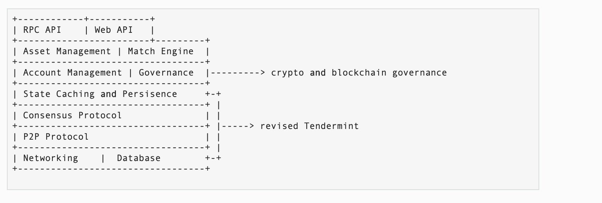
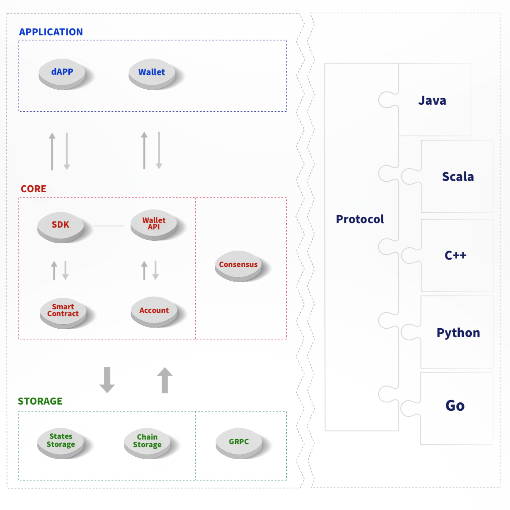
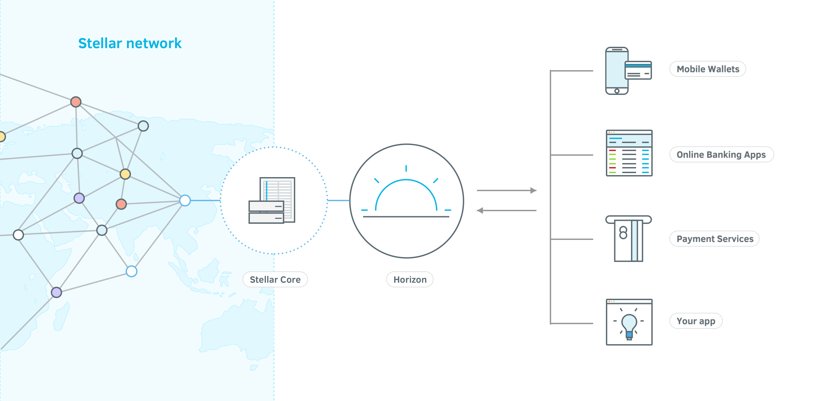
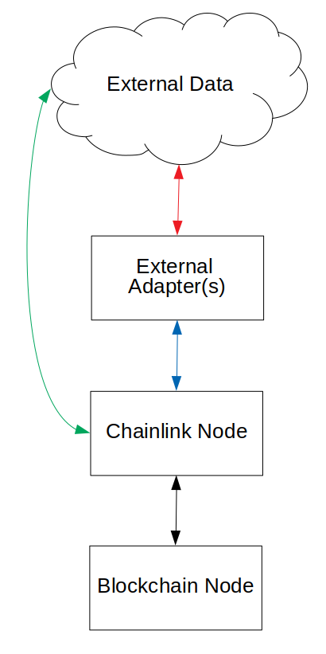
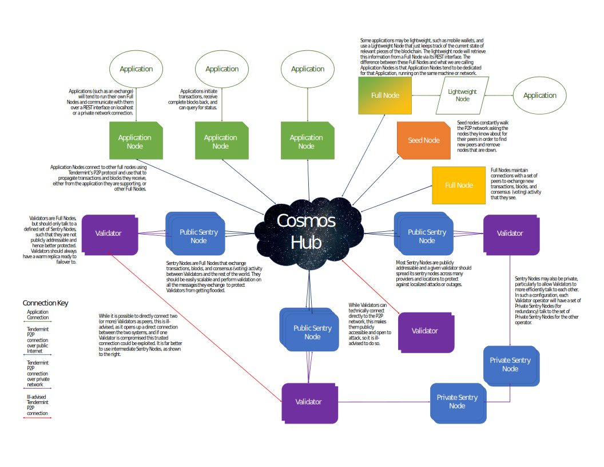
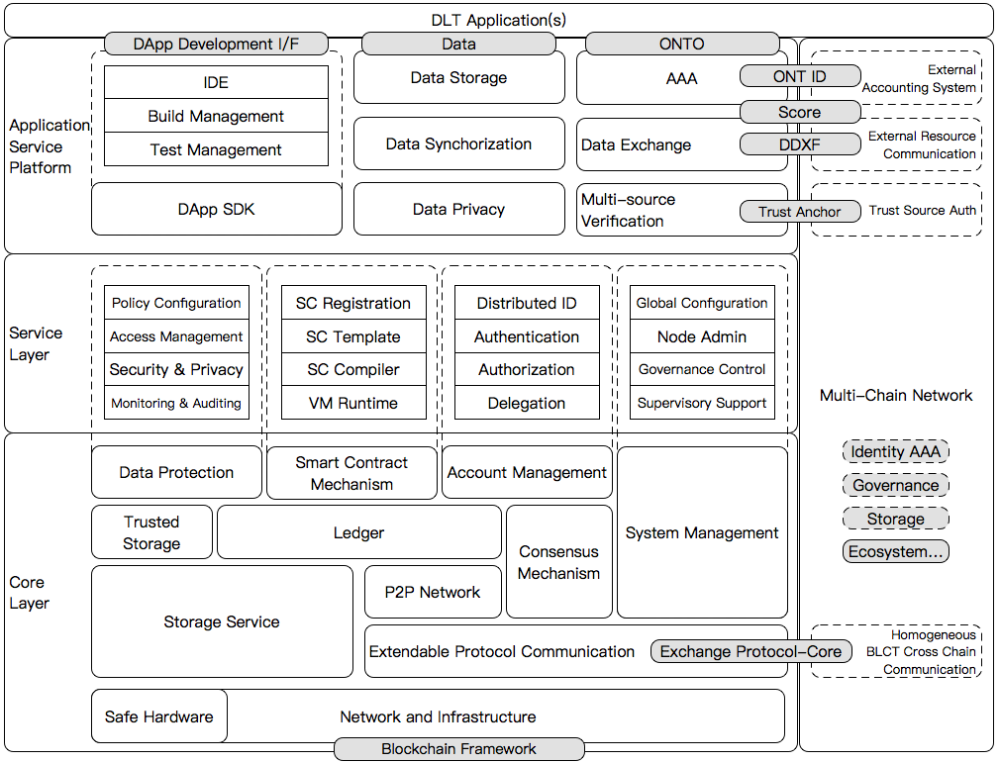
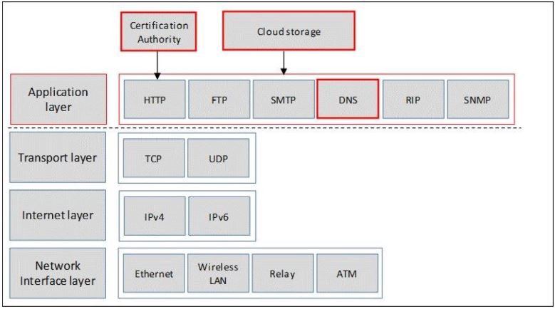
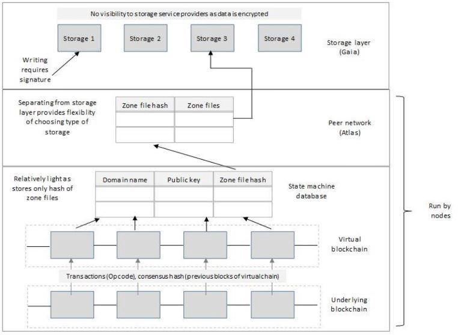

# blockchain survey

## Statistics
### Number of full nodes
| Project name            | Number of full nodes   | Number of validators or miner | Notes                                      |
| ---                           | ---                               | ---                             | ---                                        |
| bitcoin                      | 10447                          |                        | https://bitnodes.earn.com/ |
| ethereum                  | 8013                            |                        | https://www.ethernodes.org/network/1 |
| ripple                        | 1010(stock nodes)                                  | 126 validators, 11 XRP ledger gateway                 | https://xrpcharts.ripple.com/#/topology |
| Litecoin                        | 1820                                  |                  |  |
| Bitcoin Cash                        | 1410                                  |                  |  |
| EOS                        | 507(top21 and standby)                                  | 21                  |  |
| Binance Coin                        |                                    |  11                 | 4 accerated node |
| Tether                        |                                    |                   |  |
| Bitcoin SV                        | 355                                   |                   |  |
| TRON                        | 1197                                   | 27                  |  |
| Cardano                        |                                    |                   |  |
| Stellar                        |                                   |    56               |  |
| UNUS SED LEO                        |                                   |    56               |  |
| Monero                        | 1398                                  |                   |  |
| Dash                        | 4801                                  |                   |  |
| Chainlink                        |                                   |                   |  |
| NEO                        |                                   |  7                 |  |
| IOTA                        |  121                                 |                   |  |
| Cosmos                        |                                   |  176                 | https://www.mintscan.io/validators |
| Ethereum Classic                        |  13                                 |                  |  |
| NEM                        |  439                                 |                  |  |
| Zcash                        |  395                                 |                  | https://explorer.zcha.in/network |
| Ontology                        |                                   |  57                |  |
| Maker                        |                                   |                  |  on ethereum |
| Tezos                        |                                   |                  |   |
| Qtum                        |   6336                                |                  |   |
| Basic Attention Token                        |                                   |                  | https://basicattentiontoken.org/  |

## bitcoin
[Summary](bitcoin.md)

## ethereum

## ripple 
[Summary](ripple.md)

## Litecoin

## Bitcoin Cash

## EOS
[Summary](eos.md)

## Binance Coin

consensus - https://github.com/tendermint/tendermint/blob/master/docs/spec/consensus/consensus.md

## Tether

## Bitcoin SV

## TRON
[Summary](tron.md)

## Cardano
[Summary](cardano.md)

## Stellar
[Summary](stellar.md)

## UNUS SED LEO

## Monero

## Dash
[Summary](dash.md)

## Chainlink
[Summary](chainlink.md)

https://docs.chain.link/docs/architecture-overview

## NEO
[Summary](neo.md)

## IOTA

## Cosmos
[Summary](cosmos.md)

## Ethereum Classic

## NEM
[Summary](nem.md)

## Zcash

## ontology
[Summary](ontology.md)

## Maker
[Summary](maker.md)

## Tezos

## Qtum

## Basic Attention Token
[Summary](bat.md)

## Blockstack
[Summary](blockstack.md)

https://medium.com/tokenmonk/blockstack-the-fat-protocol-architecture-explained-1beedd745aaa

