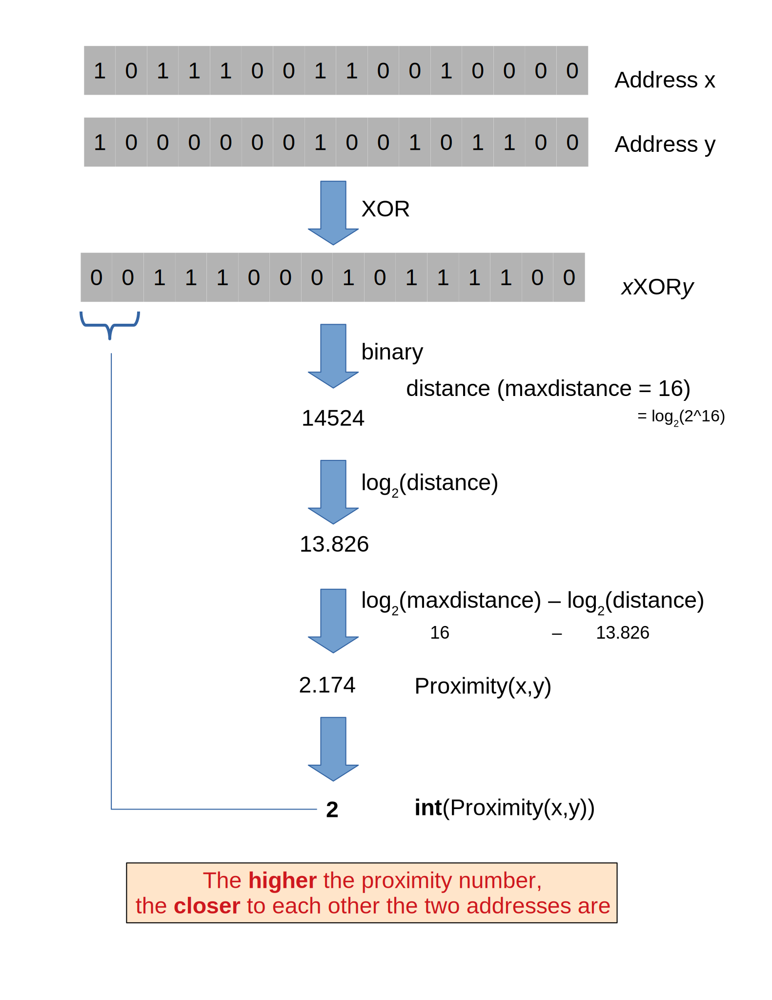

# Storage system

## Swarm 
https://swarm.ethereum.org/
https://github.com/ethersphere/swarm/

Swarm is a distributed storage platform and content distribution network, a native base layer service of the Ethereum web3 stack.

The primary objective of Swarm is to provide a sufficiently decentralized and redundant store of Ethereum’s public record, in particular to store and distribute dapp code and data as well as blockchain data. From an economic point of view, it allows participants to efficiently pool their storage and bandwidth resources in order to provide these services to all participants of the network, all while being incentivised by Ethereum.

`Uploaded content is not guaranteed to persist on the testnet until storage insurance is implemented` (see Roadmap for more details). All participating nodes should consider participation a voluntary service with no formal obligation whatsoever and should be expected to delete content at their will. Therefore, users should under no circumstances regard Swarm as safe storage until the incentive system is functional.

### developer
- Leader: https://www.linkedin.com/in/viktortron

### Sponsors and collaborators
http://status.im
http://livepeer.org
http://jaak.io
http://datafund.io
http://mainframe.com
http://wolk.com
http://riat.at
http://datafund.org
http://216.com
http://cofound.it
http://iconomi.net
http://infura.io
http://epiclabs.io
http://asseth.fr

### Architecture
https://swarm-guide.readthedocs.io/en/latest/architecture.html#architecture

#### Overlay network

##### Logarithmic distance

##### Topology

##### Bootstrapping and discovery
The protocol is as follows: Initially, each node has zero as their saturation depth. Nodes keep advertising to their connected peers info about their saturation depth as it changes. If a node establishes a new connection, it notifies each of its peers about this new connection if their proximity order relative to the respective peer is not lower than the peer’s advertised saturation depth (i.e., if they are sufficiently close by). The notification is always sent to each peer that shares a PO bin with the new connection. These notification about connected peers contain full overlay and underlay address information. Light nodes that do not wish to relay messages and do not aspire to build up a healthy kademlia are discounted.

As a node is being notified of new peer addresses, it stores them in a kademlia table of known peers. While it listens to incoming connections, it also proactively attempts to connect to nodes in order to achieve saturation: it tries to connect to each known node that is within the PO boundary of N nearest neighbours called nearest neighbour depth and (2) it tries to fill each bin up to the nearest neighbour depth with healthy peers. To satisfy (1) most efficiently, it attempts to connect to the peer that is most needed at any point in time. Low (far) bins are more important to fill than high (near) ones since they handle more volume. Filling an empty bin with one peer is more important than adding a new peer to a non-empty bin, since it leads to a saturated kademlia earlier. Therefore the protocol uses a bottom-up, depth-first strategy to choose a peer to connect to. Nodes that are tried but failed to get connected are retried with an exponential backoff (i.e., after a time interval that doubles after each attempt). After a certain number of attempts such nodes are no longer considered.

After a sufficient number of nodes are connected, a bin becomes saturated, and the bin saturation depth can increase. Nodes keep advertising their current saturation depth to their peers if it changes. As their saturation depth increases, nodes will get notified of fewer and fewer new peers (since they already know their neighbourhood). Once the node finds all their nearest neighbours and has saturated all the bins, no new peers are expected. For this reason, a node can conclude a saturated kademlia state if it receives no new peers (for some time). The node does not need to know the number of nodes in the network. In fact, some time after the node stops receiving new peer addresses, the node can effectively estimate the size of the network from the depth (depth n implies 2n nodes)

Such a network can readily be used for a forwarding-style messaging system. Swarm’s PSS is based on this. Swarm also uses this network to implement its storage solution.

#### Distributed preimage archive

A DPA is opinionated about which nodes store what content and this implies a few more restrictions:
(1) load balancing of content among nodes is required and is accomplished by splitting content into equal sized chunks (chunking);
(2) there has to be a process whereby chunks get to where they are supposed to be stored (syncing); and
(3) since nodes do not have a say in what they store, measures of plausible deniability should be employed.

##### Redundancy
The area of the fully connected neighbourhood defines an area of responsibility.
A storer node is responsible for (storing) a chunk if the chunk falls within the node’s area of responsibility. Let us assume, then,
(1) a forwarding strategy that relays requests along stable nodes and
(2) a storage strategy that each node in the nearest neighbourhood (of mimimum R peers) stores all chunks within the area of responsibility. As long as these assumptions hold, each chunk is retrievable even if R−1 storer nodes drop offline simultaneously.
As for (2), we still need to assume that every node in the nearest neighbour set can store each chunk.

Further measures of redundancy, e.g. (Erasure coding)[https://en.wikipedia.org/wiki/Erasure_code], will be implemented in the future.

##### Caching and purging Storage
What a node stores is determined by the access count of chunks: if we reach the capacity limit for storage the oldest unaccessed chunks are removed.
On the one hand, this is backed by an incentive system rewarding serving chunks. This directly translates to a motivation, that a content needs to be served with frequency X in order to make storing it profitable.
On the one hand , frequency of access directly translates to storage count.
On the other hand, it provides a way to combine proximity and popularity to dictate what is stored.

This storage protocol is designed to result in an autoscaling elastic cloud where a growth in popularity automatically scales. An order of magnitude increase in popularity will result in an order of magnitude more nodes actually caching the chunk resulting in fewer hops to route the chunk, ie., a lower latency retrieval.

##### Synchronisation
Smart synchronisation is a protocol of distribution which makes sure that these transfers happen.

Apart from access count which nodes use to determine which content to delete if capacity limit is reached, `chunks also store their first entry index`. This is an arbitrary monotonically increasing index, and nodes publish their current top index, so `virtually they serve as timestamps of creation`. This index helps keeping track what content to synchronise with a peer.

 
#### Data layer
There are 4 different layers of data units relevant to Swarm:

* message: p2p RLPx network layer. Messages are relevant for the devp2p wire protocols

* chunk: fixed size data unit of storage in the distributed preimage archive

* file: the smallest unit that is associated with a mime-type and not guaranteed to have integrity unless it is complete. This is the smallest unit semantic to the user, basically a file on a filesystem.

* collection: a mapping of paths to files is represented by the swarm manifest.
This layer has a mapping to file system directory tree. Given trivial routing conventions, a url can be mapped to files in a standardised way, allowing manifests to mimic site maps/routing tables. As a result, Swarm is able to act as a webserver, a virtual cloud hosting service.

The actual storage layer of Swarm consists of two main components, the localstore and the netstore.

The local store consists of an in-memory fast cache (memory store) and a persistent disk storage (dbstore).

The NetStore is extending local store to a distributed storage of Swarm and implements the distributed preimage archive (DPA).

##### Files
The component that chunks the files into the merkle tree is called the chunker.
Our chunker implements the bzzhash algorithm which is parallellized tree hash based on an arbitrary chunk hash.

##### Manifests

#### Components

### Technology
* BZZ - Scalable distributed storage solution and content distribution network
ENS is the system that Swarm uses to permit content to be referred to by a human-readable name, such as “theswarm.eth”. It operates analogously to the DNS system, translating human-readable names into machine identifiers - in this case, the Swarm hash of the content you’re referring to. By registering a name and setting it to resolve to the content hash of the root manifest of your site, users can access your site via a URL such as bzz://theswarm.eth/.
  - ENS video: https://youtu.be/pLDDbCZXvTE
  - Register domain name: https://manager.ens.domains/

* ACT - Access control and Authentication
Swarm supports restricting access to content through several access control strategies:
- Password protection - where a number of undisclosed parties can access content using a shared secret (pass, act)
- Selective access using Elliptic Curve key-pairs:
  - For an undisclosed party - where only one grantee can access the content (pk)
  - For a number of undisclosed parties - where every grantee can access the content (act)

* PSS - Secure real-time node-to-node push messaging
pss (Postal Service over Swarm) is a messaging protocol over Swarm with strong privacy features. The pss API is exposed through a JSON RPC interface described in the API Reference, here we explain the basic concepts and features.

* Feeds - Asynchronous pull messaging
If you are using Feeds in conjunction with an ENS resolver contract, only one initial transaction to register the “Feed manifest address” will be necessary. This key will resolve to the latest version of the Feed (updating the Feed will not change the key).

If you are using Feeds in conjunction with an ENS resolver contract, only one initial transaction to register the “Feed manifest address” will be necessary. This key will resolve to the latest version of the Feed (updating the Feed will not change the key).

  - Manifests
  In general manifests declare a list of strings associated with Swarm hashes. A manifest matches to exactly one hash, and it consists of a list of entries declaring the content which can be retrieved through that hash. 

  - Encryption
  Swarm uses (Counter mode encryption)[https://en.wikipedia.org/wiki/Block_cipher_mode_of_operation#Counter_(CTR)] to encrypt and decrypt content. When you upload content to Swarm, the uploaded data is split into 4 KB chunks. These chunks will all be encoded with a separate randomly generated encryption key. The encryption happens on your local Swarm node, unencrypted data is not shared with other nodes. The reference of a single chunk (and the whole content) will be the concatenation of the hash of encoded data and the decryption key. This means the reference will be longer than the standard unencrypted Swarm reference (64 bytes instead of 32 bytes).

When your node syncs the encrypted chunks of your content with other nodes, it does not share the full references (or the decryption keys in any way) with the other nodes. This means that other nodes will not be able to access your original data, moreover they will not be able to detect whether the synchronized chunks are encrypted or not.

When your data is retrieved it will only get decrypted on your local Swarm node. During the whole retrieval process the chunks traverse the network in their encrypted form, and none of the participating peers are able to decrypt them. They are only decrypted and assembled on the Swarm node you use for the download.

    - Counter mode encryption
    https://zh.wikipedia.org/wiki/%E5%88%86%E7%BB%84%E5%AF%86%E7%A0%81%E5%B7%A5%E4%BD%9C%E6%A8%A1%E5%BC%8F
    密码学中，分组（block）密码的工作模式（mode of operation）允许使用同一个分组密码密钥对多于一块的数据进行加密，并保证其安全性。[1][2] 分组密码自身只能加密长度等于密码分组长度的单块数据，若要加密变长数据，则数据必须先被划分为一些单独的密码块。通常而言，最后一块数据也需要使用合适填充方式将数据扩展到匹配密码块大小的长度。一种工作模式描述了加密每一数据块的过程，并常常使用基于一个通常称为初始化向量的附加输入值以进行随机化，以保证安全[1]。
    工作模式主要用来进行加密和认证。[1][3] 对加密模式的研究曾经包含数据的完整性保护，即在某些数据被修改后的情况下密码的误差传播特性。后来的研究则将完整性保护作为另一个完全不同的，与加密无关的密码学目标。部分现代的工作模式用有效的方法将加密和认证结合起来，称为认证加密模式。      虽然工作模式通常应用于对称加密[2]，它亦可以应用于公钥加密，例如在原理上对RSA进行处理，但在实用中，公钥密码学通常不用于加密较长的信息，而是使用结合对称加密和公钥加密的混合加密方案[1]。
    

* SW3 (Swap, Swear and Swindle) - Accounting and accountability

* Swarm DB - Trustless database services

